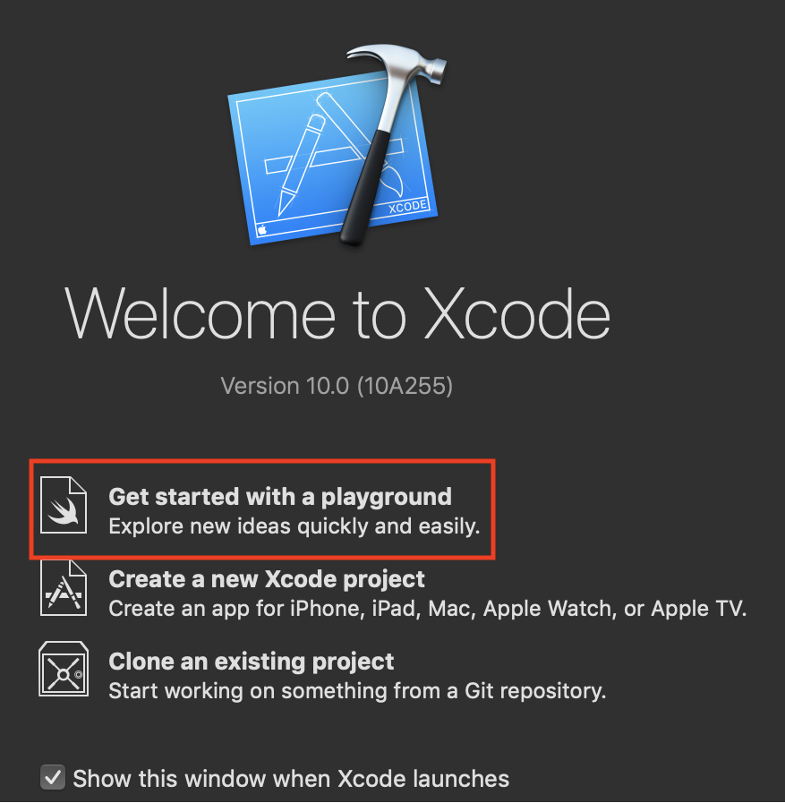
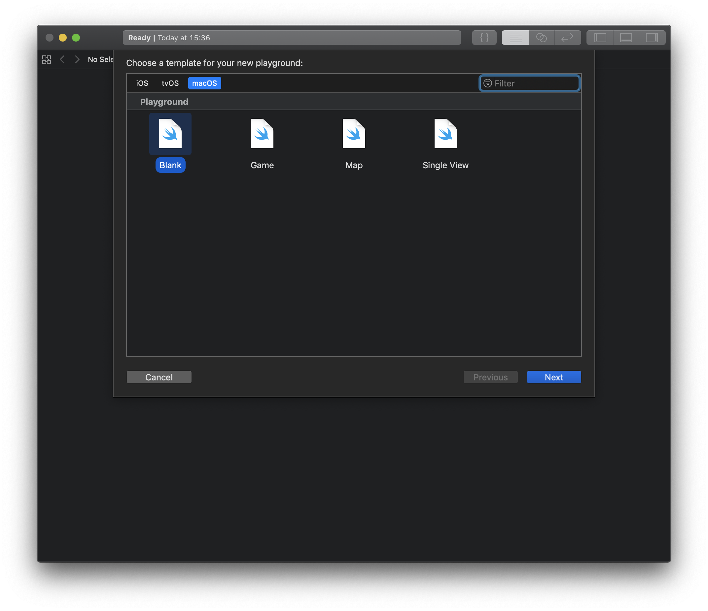
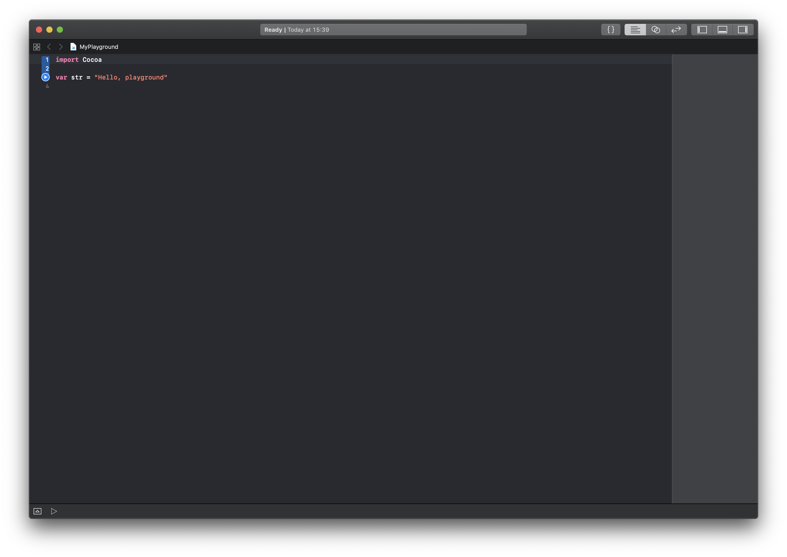
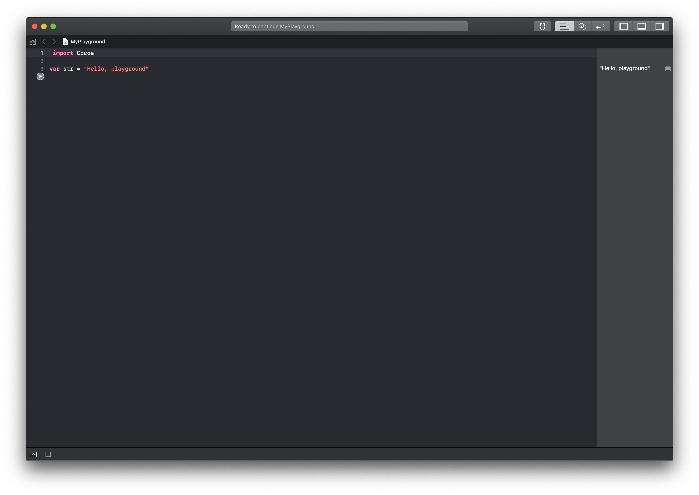
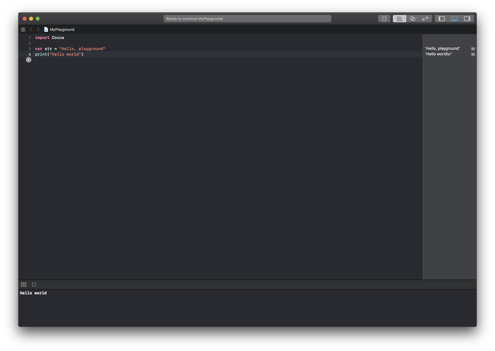
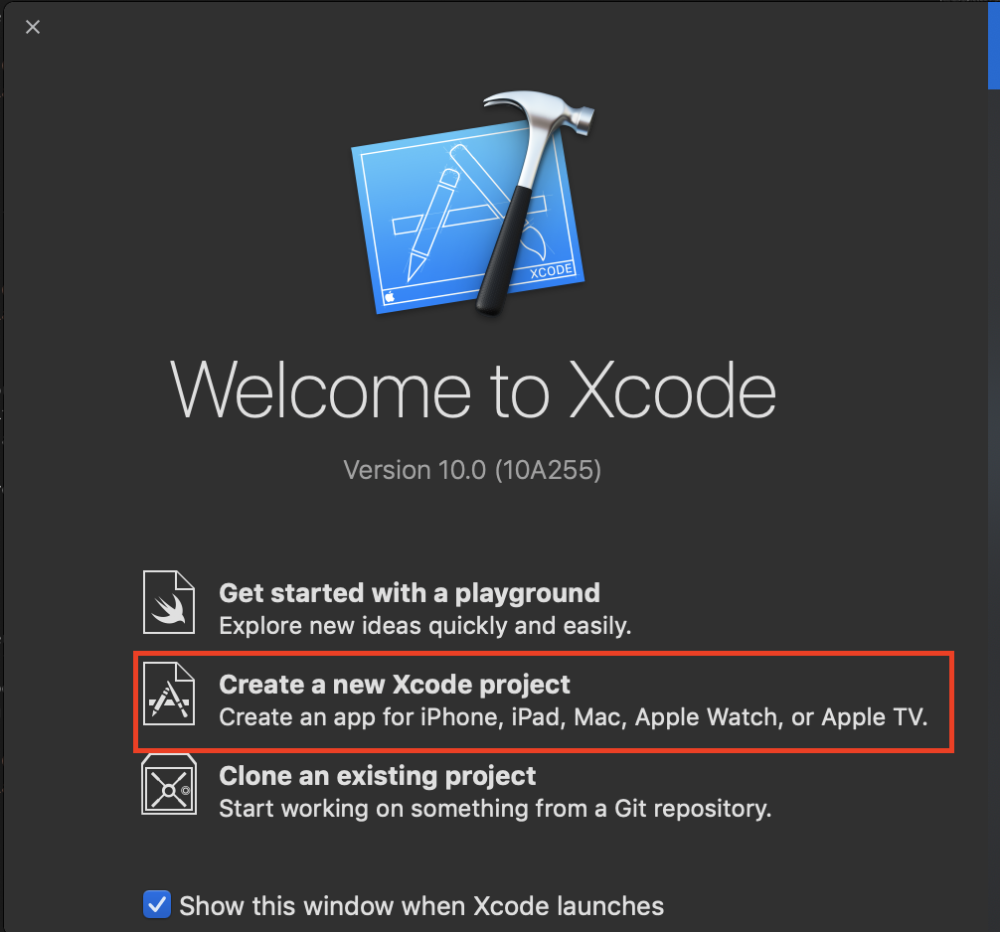
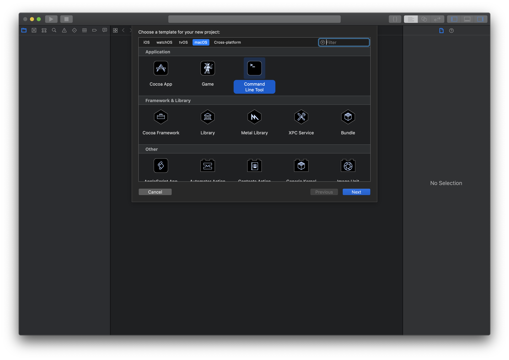
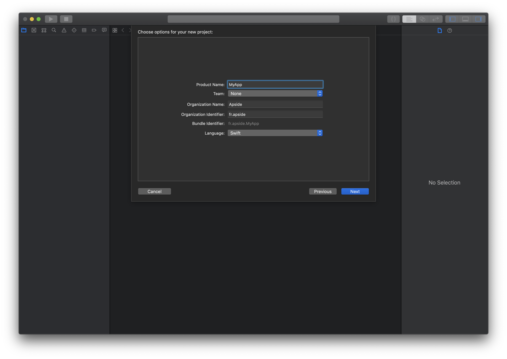
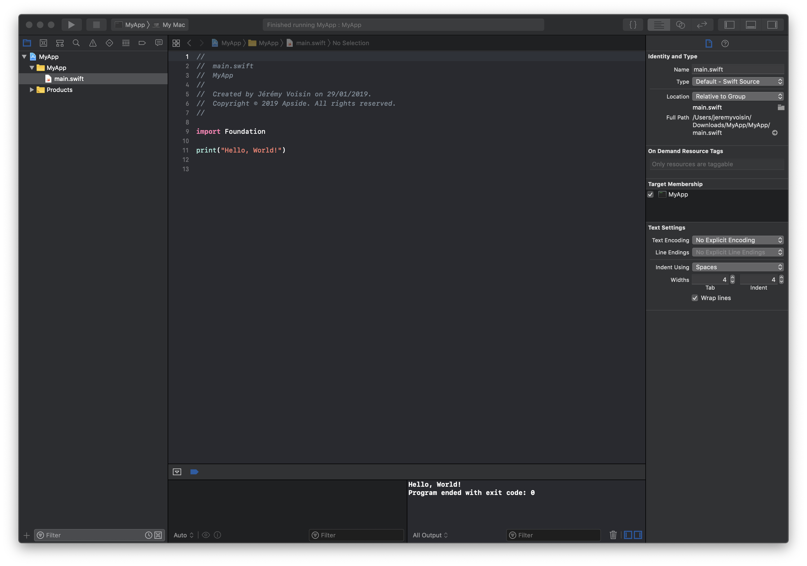

# TP1 - Prise en main des environnements Swift

## Introduction

Il s'agit, dans ce premier TP, de découvrir les environnements de développement et d'exécution de Swift.


## Exercices

### 1. La read–eval–print loop (REPL) Swift

Swift, de la même façon que des langages interprétés comme Python et Ruby, dispose d'une REPL qui permet entre autres l'exécution temps réel d'une instruction en conservant tout ce qui est déclaré précédemment dans l'exécution courante.

Pour ouvrir la REPL Swift, il suffit, dans un terminal, d'entrer la commande **`swift`**. Il doit s'afficher le résultat suivant :

```
Welcome to Apple Swift version 4.2.1 (swiftlang-1000.0.42 clang-1000.0.45.1). Type :help for assistance.
   1> 
```

Dès que le `1>` s'affiche, il est possible d'entrer des instructions Swift. Entrez la ligne suivante :

```swift
1> print("Hello world")
```

Le résultat devrait être :

```swift
1> print("Hello world")
Hello world
```

Sur ubuntu, il est possible d'installer une REPL en installant au préalable cLang, puis en téléchargant le package à [cette adresse](https://swift.org/download/)

### 2. Playground XCode

XCode propose également aux développeurs de pouvoir exécuter du code quasiment en temps réel via un outil appelé le playground. Cet outil peut permettre de pratiquer plus facilement grâce à l'interface simple proposée. Il s'agit donc surtout d'une interface utilisée pour l'éducation ou pour exécuter rapidement du code simple.

Pour créer un nouveau playground, il suffit d'ouvrir XCode et choisir l'option **"Get started with a playground"**.

<div style="margin:50px;text-align: center">
    
</div>

Xcode demandera ensuite quel type de projet nous souhaitons, nous choisirons le template **"Blank"** sous l'onglet macOS.

<div style="margin:50px;text-align: center">
    
</div>

Un nom est ensuite demandé, vous pouvez laisser MyPlayground et l'enregistrer où vous le souhaitez, cela vous enregistrera donc un fichier .playground.

Vous arrivez ensuite sur la vue du playground Swift.

<div style="margin:50px;text-align: center">
    
</div>

Dans cette vue, nous voyons un import de librairie et une déclaration de variable, nous y reviendrons dans les TP suivants.
Sur la gauche de la fenêtre, nous appercevons une petite flêche bleue, celle ci est dédiée à l'exécution du code, appuyons dessus.

<div style="margin:50px;text-align: center">
    
</div>

Nous n'avons pas ajouté de `print` et pourtant nous voyons tout de même quelque chose sortir de notre programme ? Oui, la partie droite de la fenêtre est l'inspecteur d'environnement d'exécution, il nous permet de récapituler ce qui est déclaré dans le contexte d'exécution.

Comme pour le cas précédents, ajoutons maintenant au playground la ligne suivante :

```swift
print("Hello world")
```

La petite flêche bleue n'est plus présente que sur la ligne que nous venons d'ajouter. Ceci indique que le playground à retenu le contexte d'exécution exécuté jusqu'à maintenant et qu'il n'exécutera que les nouvelles instructions. Cela permet d'économiser du temps en ne ré-exécutant pas tout le programme à chaque fois. Cliquons une nouvelle fois sur la flêche bleue.

<div style="margin:50px;text-align: center">
    
</div>

Un nouveau composant apparaît en bas de fenêtre, il s'agit de la console de sortie. Cette fois, le `print` est exécute, la sortie s'affiche donc.

### 3. Projet XCode classique

Cette fois ci nous allons créer un projet classique, tels que nous pourrions en créer pour démarrer une nouvelle application, ou que nous trouverions dans un projet existant.

Nous allons revenir sur l'écran de création de projet et sélectionner **`Create a new Xcode project`**.

<div style="margin:50px;text-align: center">
    
</div>

Ensuite, nous choisirons le template **`Command Line Tool`** sous l'onglet macOS.

<div style="margin:50px;text-align: center">
    
</div>

Xcode nous demande quelques informations.

<div style="margin:50px;text-align: center">
    
</div>

Nous arrivons finalement dans la vue principale de notre projet sur XCode. Nous pouvons sélectionner le fichier main.swift qui est créé par défaut.

<div style="margin:50px;text-align: center">
    
</div>

Cette fois, le "Hello world" est déjà créé, cliquons sur le bouton **`Play`** en haut à gauche du projet pour lancer le projet. La console s'ouvre et affiche une nouvelle fois Hello world !

## Conclusion

Bravo ! Nous maîtrisons désormais l'exécution de Swift dans différents environnements de developpement, nous sommes prêt à lancer la plupart des projets Swift.

[Repl.it](https://repl.it/live/rYYrGkdVvt9M1A)